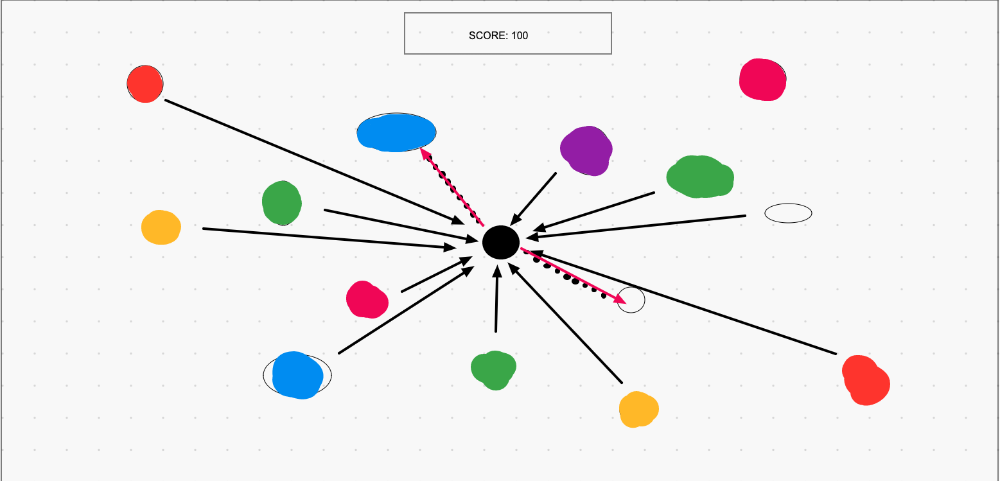

# Asteroids

## Objective

- Destroy 7 asteroids before impact

- If you can manage to destroy 7 before impact, your mission complete message will be delivered promptly

## Instructions

- Aim with cursor

- Fire projectiles with mouse click

- Spam ammo as needed

- Click "play again" after a win or lose to increase difficulty

- Designed for larger screens and external mouse


### Code

Asteroids was built with Javascript. The core functionality was built with constructor functions to render the player and the asteroids, and animation functions to bring them to life. Building was a challenge, as I was unfamiliar with the triggonometry calculations required to calculate the angles between the projectiles and the asteroids, and the distance between the player and the asteroids. Here's a code snippet of the fire projectile function:

```javascript
canvas.addEventListener('click', (e) => {
    const angle = Math.atan2(e.pageY - y, e.pageX - x)
    const speed = 25
    const velocity = {
        x: Math.cos(angle) * speed,
        y: Math.sin(angle) * speed
    }
    projectiles.push(new Shot(x, y, 5, 'orange', velocity)
    )
})
```

Using `Math.atan2()`, I passed the x and y coordinates of the click location on the page to find the angle relative the player. Once the angle was established, I used `Math.cos` and `Math.sin` to find the cosine and sin of the triangle and then set velocity.

Fail condition was established using the `Math.hypot()` function, which I used to find the distance between the player and the incoming asteroids.

```javascript
for (let i = 0; i < asteroids.length; i++) {
            const distance = Math.hypot(player.x - asteroids[i].x, player.y - asteroids[i].y)
            if (distance < player.radius + asteroids[i].radius) {
                document.querySelector('#fail').style.display = "block"
                return
            }
        }
```

### Pre-build Wireframe

